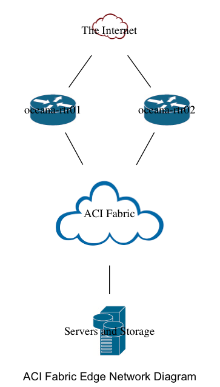

 
 
 
 
 
 
 
# High Level Design Document
##   Underwater Corporation Software Defined Data Center
 
 
 
Author: **Claudia de Luna**
 
Company: _Indigo Wire Networks_
 
Email: _claudia@indigowire.net_
 
 
Date:   2019-08-16 08:26:20.150995
 
 
 
 
 
 
 
 
 
 
 
 
 
 
 
 

 
\pagebreak 

## 1. Introduction
 
This document will detail the high level design for the new Underwater Corporation Software Defined Data center located in Guadalajara, Mexico in the Marcatel Guadalajara CoLocation buidling at Av. Chapultepec No. 236 Col. Americana, Sector Ju 44160.
 
 
 

\pagebreak

## 2. Design Overview
 
This is the overview text for the HLD document. This will introduce the HLD Diaagram 
 

 
 

\pagebreak

## 3. Equipment Details
 

### Equipment Details for Cisco device Cisco-IOS-XE-native:native

 
The primary WAN router, oceana-rtr01, will host the primary 10G circuit to the partner data center.  It will also host the Primary 1G DIA Internet circuit.
 
#### General Information
 
Model: CSR1000V
 
Serial Number: 9YES7U3F0TA
 
Hostname: oceana-rtr01
 
Software Version: 16.9
 

 
uwaco.net
 
['8.8.8.8']
 
#### Interfaces
 

GigabitEthernet1
 
Description: 
IP Information: {'dhcp': {}}
 

GigabitEthernet2
 
Description: 
IP Information: {'primary': {'address': '1.1.1.1', 'mask': '255.255.255.0'}}
 

GigabitEthernet3
 
Description: 
IP Information: {'primary': {'address': '2.2.2.1', 'mask': '255.255.255.0'}}
 

Loopback0
 
Description: Source Loopback0
IP Information: {'primary': {'address': '192.0.2.1', 'mask': '255.255.255.255'}}
 

### Equipment Details for Cisco device Cisco-IOS-XE-native:native

 
The secondary WAN router, oceana-rtr02, will host the secondary 10G circuit to the partner data center as well as the secondary DIA Internet circuit (also 1G). 
 
#### General Information
 
Model: CSR1000V
 
Serial Number: 9YES7U3F0TA
 
Hostname: oceana-rtr02
 
Software Version: 16.9
 

 
uwaco.net
 
['8.8.8.8']
 
#### Interfaces
 

GigabitEthernet1
 
Description: 
IP Information: {'dhcp': {}}
 

GigabitEthernet2
 
Description: 
IP Information: {'primary': {'address': '2.2.2.1', 'mask': '255.255.255.0'}}
 

GigabitEthernet3
 
Description: 
IP Information: {'primary': {'address': '3.3.3.1', 'mask': '255.255.255.0'}}
 

Loopback0
 
Description: Source Loopback0
IP Information: {'primary': {'address': '192.0.2.1', 'mask': '255.255.255.255'}}
 

### 3. Details for InternetCloud
 
The new data center will support redundant 1G DIA Internet circuits.
 

 

The Internet

### 3. Details for ACICloud
 
The ACI Data Center Fabric will be built out with 4 spines, 12 leafs, and 3 APIC controllers.
 

 

ACI Fabric

### 3. Details for ServersStorage
 
Server and storage bare metal hosts will be connected directly to the ACI Leafs. ESX Hosts will utilize a combination of VPC and Trunk Uplinks depending on function.  The NetApp storage applicances will utilize Etherchannel/vPC uplinks.
 

 

Servers and Storage

 
 
 
## 4. Conclusion
 
This concludes the High Level Design Document
